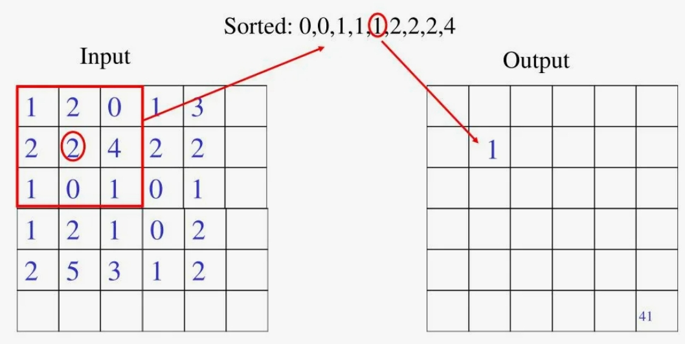
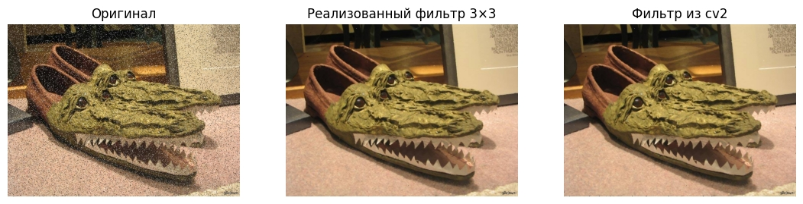
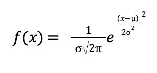

Для 1 лаб работы по CV необходимо реализовать базовый минимум операций над изображениями
Входное изображение в формате (RGB, не чёрно-белое)

1. Фильтры
 1.1. Медианный фильтр
 1.2 Фильтр гаусса
2. Морфологические операции
 2.1 Эрозия
 2.2 Дилатация
3. Прочие операции
 3.1 пороговая бинаризация (для rgb и grayscale изображения)
 3.2 выравнивание гистограммы
 3.3 поворот изображений на угол кратный 90 градусов

Использовать методы OpenCV для реализации операций нельзя. Допустимы только методы cv2.imread() и cv2.imshow(). Все методы должны быть реализованы вручную.

# Медианный фильтр

Медианный фильтр — метод обработки изображений , который заменяет значение каждого пикселя на медиану значений пикселей в его окрестности (например, в квадрате 3×3 вокруг него). Медиана — это  число, которое находится в середине упорядоченного набора данных на указаном участке.
Фильтр предназначен для удаления импульсного шума, сглаживания изображения и предварительной обработки для дальнейшей работы

Пример работы медианного фильтра приведён далее:

Теперь применим фильтр для обработки собственных изображений, также сравнив реализованный фильтр с реализацией из библиотеки cv2

# Фильтр Гаусса

Фильтр Гаусса - Используется в качестве этапа предварительной обработки изображения для сглаживания изображения, уменьшения шума и устранения ненужных деталей, которые могут мешать анализу.

Так для вычисления преобразования, применяемого к каждому пикселю изображения изначально необходимо использовать формулу функции Гаусса в нашем случае для двух измерений:

, где x, y — координаты точки, а σ — среднеквадратическое отклонение нормального распределения (задаётся вручную). Значения этого распределения используются для построения матрицы свёртки, которая применяется к исходному изображению. Также матрицу свёртки необходимо нормализовать - то есть разделить каждый элемент на сумму всех элементов матрицы. Новое значение каждого пикселя устанавливается равным средневзвешенному значению окрестности этого пикселя. 