Цель: Разработать систему визуальной одометрии (навигации) по группе фотографий.

Ход работы: 
1. Сделать 8 фото с переносом камеры или по квадрату 
2.	Определить на каждой фотографии ключевые точки
3.	Отфильтровать самые наилучшие применяя адаптивный радиус и локальные максимумы, выровнять по яркости изображения.
4.	Построить по каждой точке дескриптор (рекомендуется SIFT)
5.	Сопоставить два соседних изображения на предмет соответствия ключевых точек. То есть определите пары одинаковых точек.
6.	Построить модель преобразования изображений, учитывая только поворот и сдвиг.
7.	С учетом полученных моделей построить траекторию движения камеры.

# 1. Детектирование ключевых точек

Алгоритм обнаружения углов Харриса состоит из пяти этапов:
    - Преобразование в оттенки серого
    - Вычисление пространственных производных
    - Формирование структурного тензора
    - Расчёт отклика Харриса
    - Подавление немаксимумов

Если кратко, то данный алгоритм патается найти точки, в окрестностях которых перепады интенсивности больше определённого порога.

Детектор – это метод извлечения особых точек из изображения. Детектор обеспечивает инвариантность нахождения одних и тех же особых точек относительно преобразований изображений.

Дескриптор – идентификатор особой точки, выделяющий её из остального множества особых точек. В свою очередь, дескрипторы должны обеспечивать инвариантность нахождения соответствия между особыми точками относительно преобразований изображений [1].

# 1.1 Загрузка изображений и их первичная оработка

Загрузим изображения. 

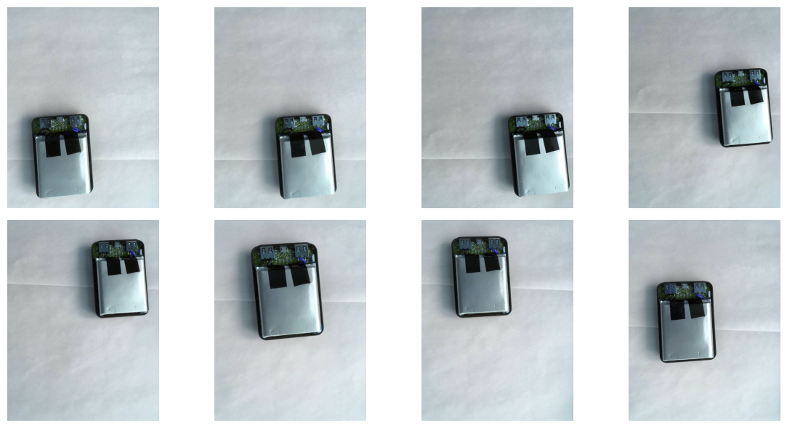

Далее воспользуемся функцией, написанной в первой лабораторной, для применения фильтра гауса

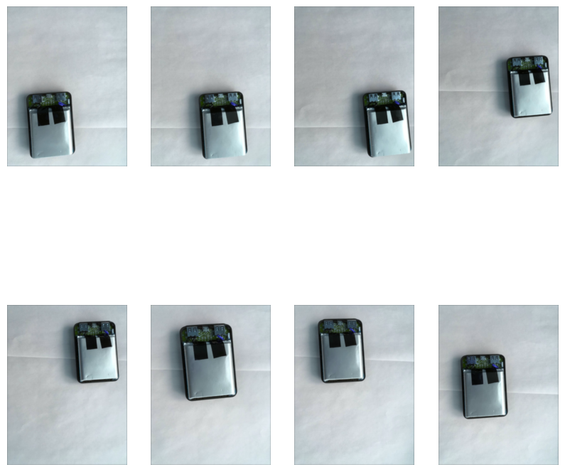

Далее воспользуемся функцией, написанной в первой лабораторной для перевода изображений в отенки серого.

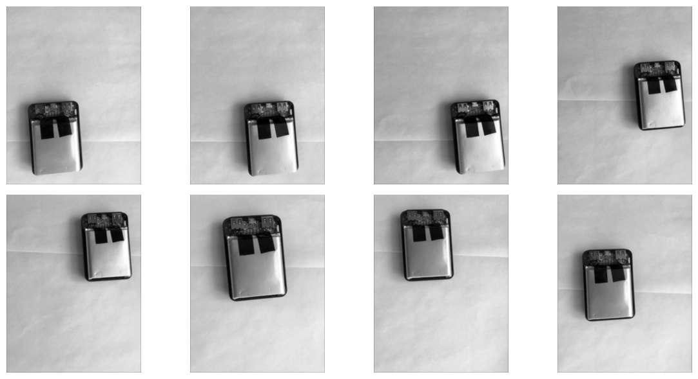

# 1.2 Расчёт карт градиентов

Далее необходимо построить карты градиентов по осям изображения. Карта же градиента представляет из себя отдельную матрицу, размером равную размеру обрабатываемого изображения. Каждый элемент этой матрицы (карты градиентов) может быть расчитан путём работы с исходным изображением разными способами, например ядрама Собеля. 

Карта же градиентов илюстрирует собою изменения интенсивности в изображениее (показывает направление наискорейшего возрастания некоторой величины, значение которой меняется от одной точки пространства к другой): так высокие значения градиента указывают на границы объектов или резкие изменения яркости, а низкие наоборот на плоскости, то есть на однородные области.

Далее приведено изображение, наглядно иллюстрирующее работу ядерр Собеля:

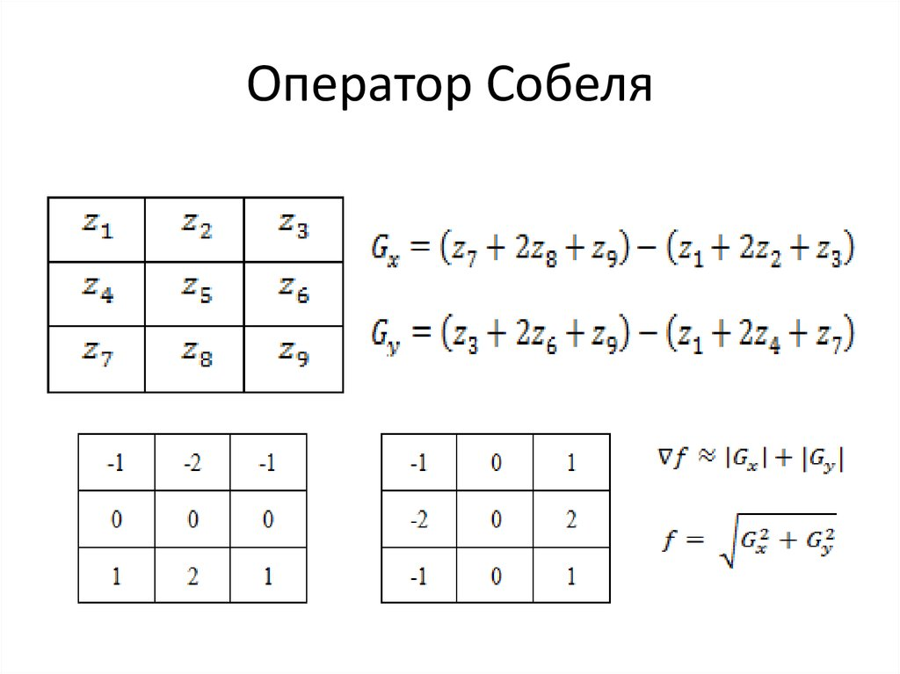

Таким образоом в ходе реализации этого алгоритма будет получено 2 карты градиентов, которые представлены далее:

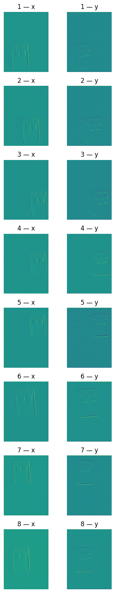

# 1.3 Расчёт структурного тензора

После расчёта карт градиентов для каждого пикселя необходимо сформировать структурный тензор, задача которого описать локальную структуру изображения в окрестности заданного пикселя. 
В дальнейшем с помощью составленного для каждого пикселя структурного тензора мы сможем установить, чем является точка: 
- Плоскостью или однородной областью (градиени не меняется)
- Краем (градиент меняется в одной плоскости)
- Углом (градиент меняется в двух плоскостях)
Далее приведен структурный тензор:

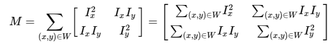

где Σ Ix² — сумма квадратов горизонтальных градиентов;
Σ Iy² — аналогично для вертикальных градиентов;
Σ Ix·Iy — смешанное произведение. Если оно велико, значит, градиенты в окне преимущественно сонаправлены (например, диагональный край). Если близко к нулю, то градиенты перпендикулярны или сбалансированы.

# 1.4 Расчёт отклика Харриса

После того, как структурный тензор был вычислен для каждого пикселя, в классической реализации метода Харриса используют отклик Харриса, формула которого задаётся следующим образом:
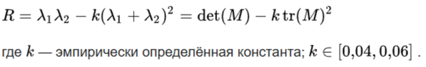
Таким образом создаётся отдельный массив того же размера, что и исходное изображение, элементы которого являются рассчитанным откликом Харриса

# 1.5 Поиск локальных максимумов

Так в ходе этого пункта задаётся окно определённого размера, выполняется цикл, в ходе которого необходимо пройтись по всей матрицы с рассчитанным откликом хариса и записать в отдельный словарь координаты точки, отклик которых является максимальным в заданном окне.

# 1.6 Сортировка углов

Так в ходе выполнения данного пункта необходимо отсортировать словарь и взять точки с наибольшим значением отклика из получившигося словаря (где ключ - величина отклика Харисса) в зависимости от заданного количества требуемых точек

Углы (corners) – особые точки, которые формируются из двух или более граней, и грани обычно определяют границу между различными объектами и / или частями одного и того же объекта. По-другому можно сказать, что углы – это точка, у которой в окрестности интенсивность изменяется относительно центра (x,y). Углы определяются по координатам и изменениям яркости окрестных точек изображения. Главное свойство таких точек заключается в том, что в области вокруг угла у градиента изображения преобладают два доминирующих направления, что делает их различимыми.
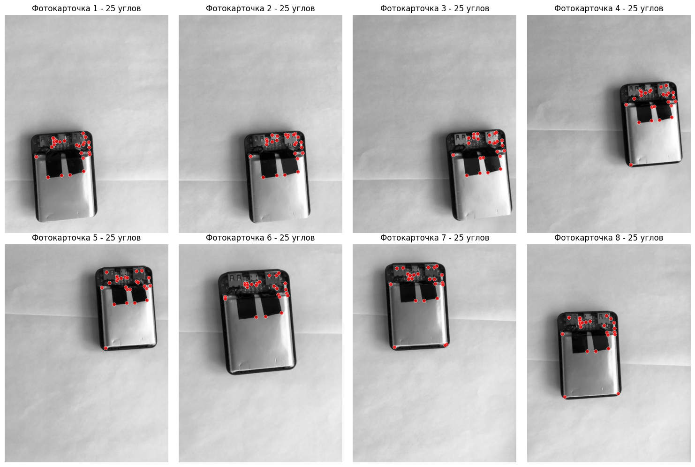

# 2 Построение дескрипторов

Далее приведена визуализация результата работы алгоритма:

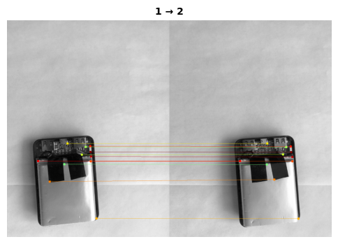
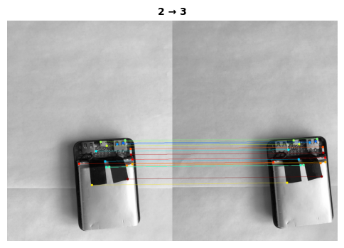
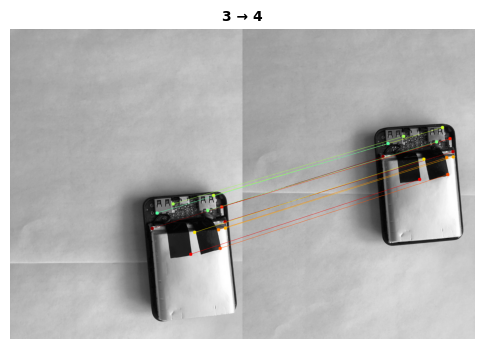
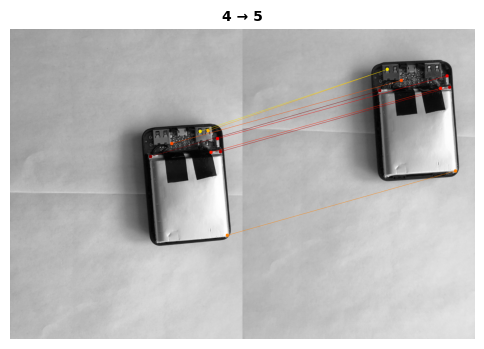
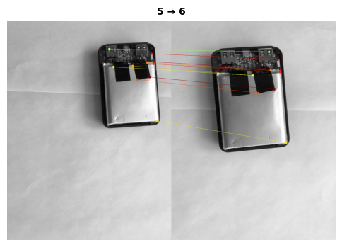
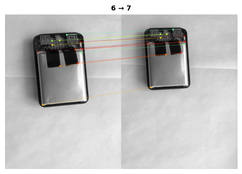
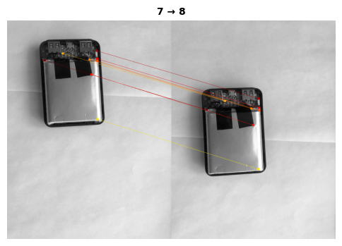

# 3 Траектория перемещения камеры

Далее приведена визуализация результата работы алгоритма:

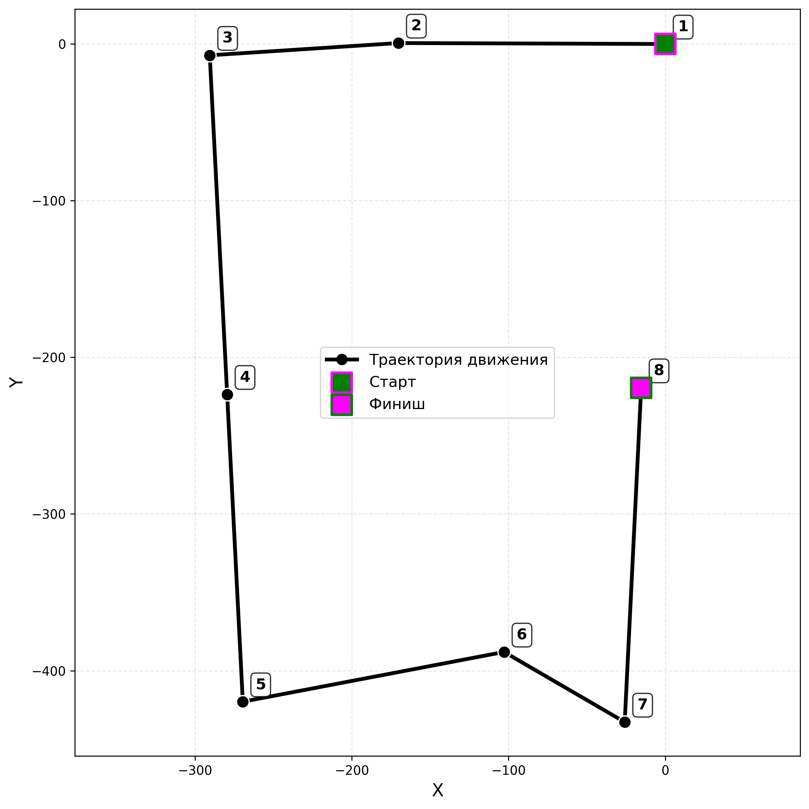
