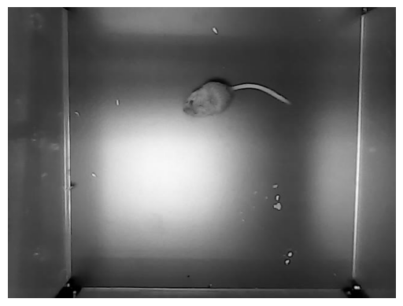
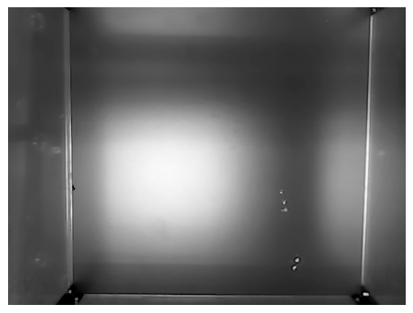
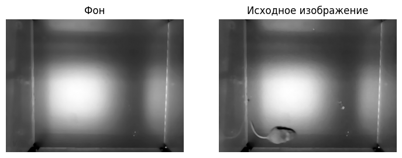
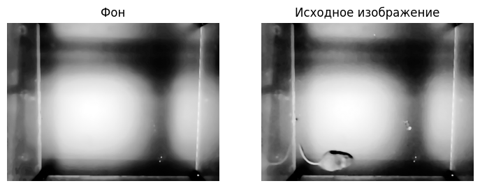
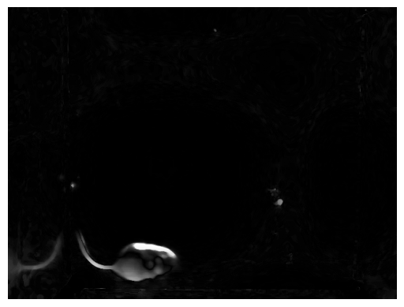
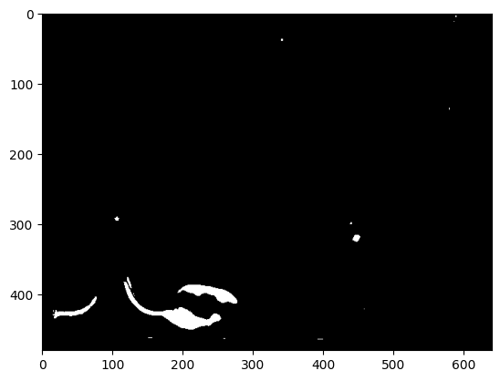
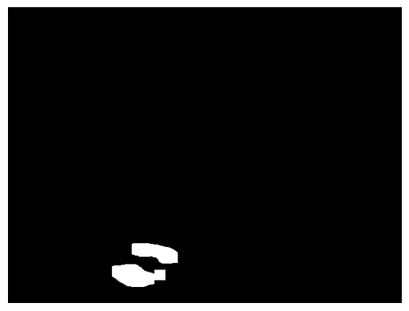
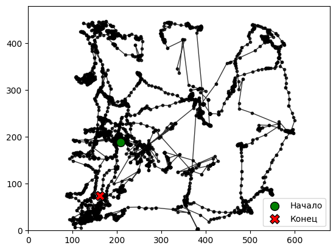

Цель: анализ видеопотока 

- Реализовать получение данных с видео;
- Реализовать алгоритм вычитания фона;
- Реализовать определение движущегося предмета;
- Построить траекторию движения объекта.

# 1. Подготовка данных 

В ходе выполнения данного пункта необходимо было выполнить следующее:
- Загрузить видео с помощью функции из cv2 VideoCapture;
- Разбить видео на отдельные кадры и записать в список frames;
- Преобразовать кадры в отенки серого для дальнейшей работы.

Далее в качестве примера приведён 1990 кадр из предложенного датасета:

# 2 Построение модели фона

В ходе данного пункта необходимо было выполнить построение модели фона, для чего была выполнена следующая последовательность действий

- Согласно размеру исходного изображения была построена матрица фона изначально с нулевыми элементами;
- Циклом прошлись по каждому пикселя каждого изображения в исходном датасете;
- Была построена гистограмма для каждого пикселя, отображающая частоту использования той или иной яркости;
- Для записи в итоговую матрицу из гистограммы каждого пикселя было отобрано наиболее часто встречающееся значение.

# 3 Подготовка фона и исходного изображения

В ходе данного пункта необходимо обработать исходное изображение и изображение фона для корректного выделения мыши. Так было выполнено следующее:

- Применение медианного фильтра к исходному кадру и фону для полавления мелких шумов;
- Нормализация гистограммы для повышения контраста и лучшего разделения объекта и фона.

Далее отображено применение медианного фильтра:

Далее отображено применение нормализации гистограммы:

# 4 Вычитание изображений

В ходе выполнения данного пункта необходимо было получить изображение, где была бы выделена мышь. Реализовано было следующее:

- Каждый пиксель исходного изображения вычитался из пикселей фона;
- Была записана абсолютная разность.

Результат работы алгоритма приведён далее:

# 5 Биноризация

Далее для полученного изображения была применена пороговая бинаризация. Результат работы алгоритма:

# 6 Очистка изображения

В ходе данного пункта необходимо было удалить шумы - то есть точки, полученные в ходе бинаризации, но не относящиеся к мыши, а также заполнить дыры внутри области изображения с мышью в виду неполного выделения мыши после бинаризации.

Результат работы далее:

# 7 Вычисление центра масс

В ходе данного пункта необходимо было вычислить среднее арифметическое из координат белых точек по обоим осям изображения. Далее цикл проходил по всем изображениям и разделял координаты центров масс на два списка: по x и y.

# 7 Траектория движения

Имея координаты центров масс на каждом изображении была построена траектория движения мыши, представленная далее 

