Цель: построение сверточной нейронной сети для решения задач классификации. 

- Реализовать загрузку и обработку данных;
- Построить модель сверточной нейронной сети;
- Обучить моедль;
- Провести анализ результатов.

# 1. Загрузка и предобработка данных

Для дальнейшей работы был взяд датасет CIFAR-10, содержащий 60000 цветных изображений размером 32x32 в 10 различных категориях: самолеты, автомобили, птицы, кошки, олени, собаки, лягушки, лошади, корабли и грузовики. Соответственно по 6000 изображений для каждой категории.

Далее приведён пример данных с датасета.

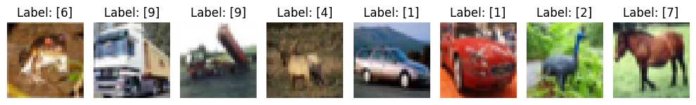

Далее изображения были разделены на 3 категории: 
- 40000 на обучение
- 10000 на валидацию
- 10000 на тестирование

Далее изображения необходимо было нормализовать - то есть разделили на максимальное значение яркости пикселя (255), чтобы перевести в диапозон чисел [0,1]

Входные данные каждого конкретного значения пикселя нормализуются в диапазон от 0 до 1, по формуле:

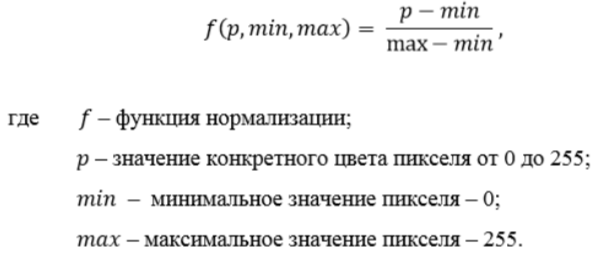

Далее преобразовали метки классов методом One-hot encoding.

# 2 Свёрточная нейронная сеть 

Свёрточные нейронные сети (CNN) — это специализированный класс искусственных нейронных сетей, разработанный для задач, где важна пространственная структура данных, например, обработка изображений или видео.

Далее представленно наглядное изображение работы слоёв свёрточной нейронной сети

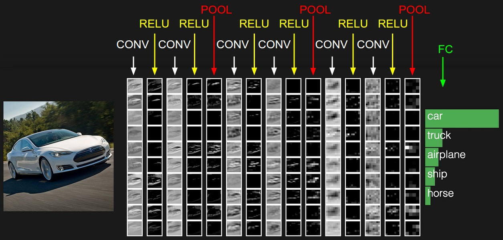

Далее подробно разберём слои, использовавшиеся в текущей модели:

- Свёртка (Conv2D): 
    это основной блок свёрточной нейронной сети. Слой свёртки включает в себя для каждого канала свой фильтр, ядро свёртки которого обрабатывает предыдущий слой по фрагментам (суммируя результаты поэлементного произведения для каждого фрагмента). Весовые коэффициенты ядра свёртки (небольшой матрицы) неизвестны и устанавливаются в процессе обучения.

Далее приведена формула применения свёртки

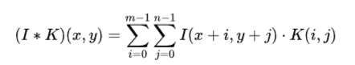

Далее приведена наглядная визуализация свёртки:

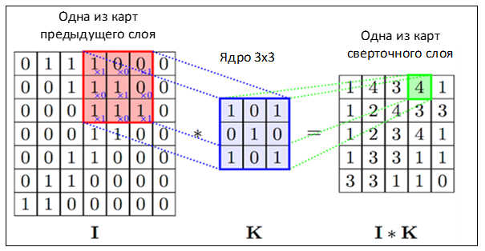

- Субдискретизация или пулинг (MaxPooling2D):
    Слой субдискретизации (иначе подвыборки, или «пулинга») представляет собой нелинейное уплотнение карты признаков, при этом группа пикселей (обычно размера 2×2) уплотняется до одного пикселя, проходя нелинейное преобразование. Наиболее употребительна при этом функция максимума. Преобразования затрагивают непересекающиеся прямоугольники или квадраты, каждый из которых ужимается в один пиксель, при этом выбирается пиксель, имеющий максимальное значение. Операция субдискретизации позволяет существенно уменьшить пространственный объём изображения. Субдискретизация интерпретируется так: если на предыдущей операции свёртки уже были выявлены некоторые признаки, то для дальнейшей обработки настолько подробное изображение уже не нужно, и оно уплотняется до менее подробного. К тому же фильтрация уже ненужных деталей помогает не переобучаться. Слой субдискретизации, как правило, вставляется после слоя свёртки перед слоем следующей свёртки.    

Далее приведена наглядная визуализация пулинга:

- Слой активации:
    Скалярный результат каждой свёртки попадает на функцию активации, которая представляет собой некую нелинейную функцию. Слой активации обычно логически объединяют со слоем свёртки (считают, что функция активации встроена в слой свёртки). Функция нелинейности может быть любой по выбору исследователя. Традиционно для этого использовали функции типа гиперболического тангенса или сигмоиды. Однако в 2000-х годах была предложена и исследована новая функция активации — ReLU (сокращение от англ. rectified linear unit, блок линейного выпрямления), которая позволила существенно ускорить процесс обучения и одновременно упростить вычисления. То есть по сути это операция отсечения отрицательной части скалярной величины.

Далее приведен пример функций активации:

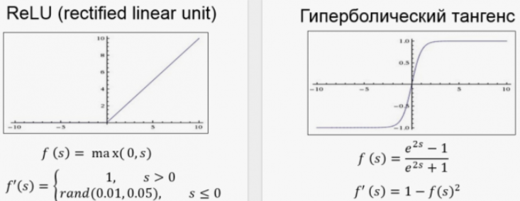

- Полносвязный слой:
    После нескольких прохождений свёртки изображения и уплотнения с помощью субдискретизации система перестраивается от конкретной сетки пикселей с высоким разрешением к более абстрактным картам признаков, как правило, на каждом следующем слое увеличивается число каналов и уменьшается размерность изображения в каждом канале. В конце концов, остаётся большой набор каналов, хранящих небольшое число данных (даже один параметр), которые интерпретируются как самые абстрактные понятия, выявленные из исходного изображения.

    Эти данные объединяются и передаются на обычную полносвязную нейронную сеть, которая тоже может состоять из нескольких слоёв. При этом полносвязные слои уже утрачивают пространственную структуру пикселей и обладают сравнительно небольшой размерностью (по отношению к количеству пикселей исходного изображения).

Далее приведен пример работы нейрона полносвязного слоя:

# 3 Обучение модели и анализ результатов

Структура модели наглядно показана далее:

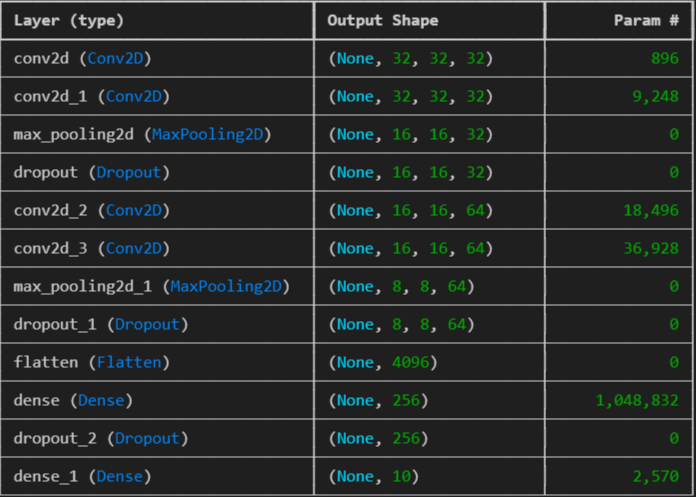

Для оценки и анализа результатов были построены графики изменения точности и функции потерь на обучении и валидации:

Обучающие метрики (loss, accuracy) показывают, насколько модель выучила паттерны из тренировочных данных. Если они улучшаются — значит, модель учится. Валидационные метрики (val_loss, val_accuracy) показывают, насколько модель обобщает — то есть способна правильно отвечать на новых, незнакомых данных.

- Loss (функция потерь) - это числовая величина, которая показывает, насколько сильно предсказания модели отличаются от истинных меток

Как функцию потерь возможно использовать среднеквадратичную ошибку:

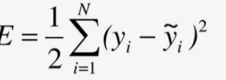

- Accuracy (точность) -  это доля правильно классифицированных примеров.

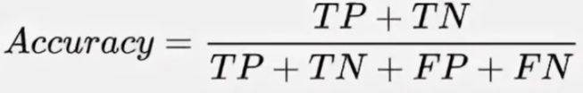

где:
- TP (True Positive) — количество наблюдений, правильно классифицированных как положительные;
- TN (True Negative) — количество наблюдений, правильно классифицированных как отрицательные;
- FP (False Positive) — количество наблюдений, ошибочно классифицированных как положительные;
- FN (False Negative) — количество наблюдений, ошибочно классифицированных как отрицательные.
Далее наглядно отображено изменение метрик в зависимости от эпох обучения:

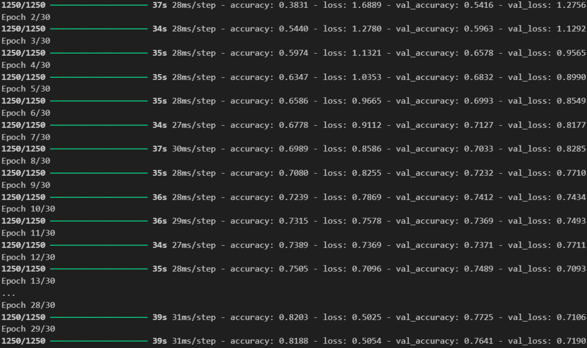

Далее построены графики изменения метрик:

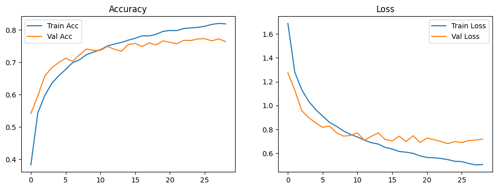

# 3 Визуализация случайных изображений с предсказаниями

Визуализация случайных изображений с предсказаниями приведена далее

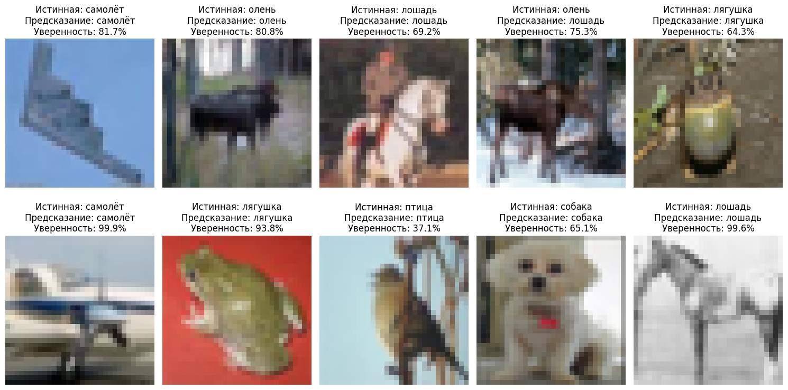
